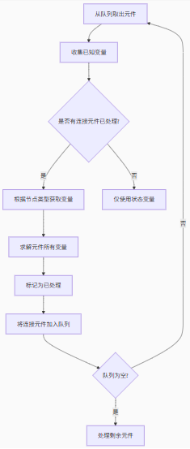
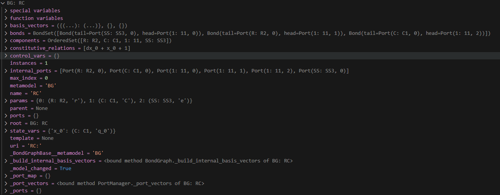
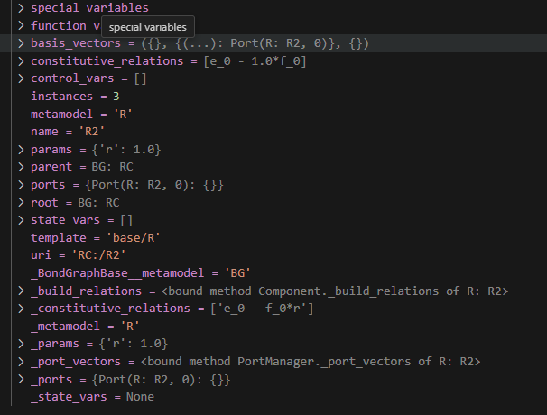
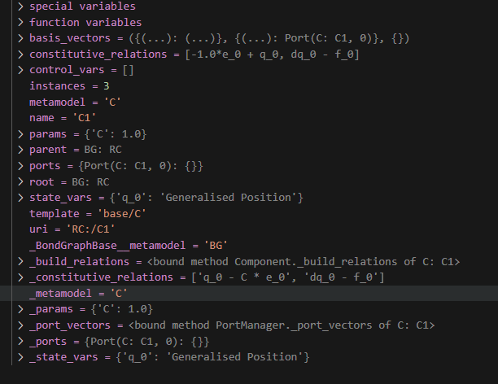

1、解释复合模块配置成标准的可利用的程序    (100%)

    （1）已经实现复合的加载和导入 (100%)

    （2）需要修改new的功能,这里增加了一个new-extend实现功能 ，设置到component文件夹,然后不改变原来解析情况下，可以创建新的复合模块。（100%）

    （3）创建的复合模块可以直接用于测试和运行，解决submodel存储为配置文件的问题。（100%）

    （4） 需要修改parme的配置以实现嵌套子模块的运行和测试问题（100%）

     **new_extend(if submodel)-->获取模块json--->替换参数--->CompositeBuilder(if submodel---->new_extend, else new---->end)**

2、后处理程序设置成代码，最好针对每种元件，可以有专门的后处理，方便后续调用和访问

model(state_vars,bonds) ---R---C

模块后处理代码步骤分析：（以R<--1<--C）模块为例

(1)根据model.state_vars,得出simulate的结果是 x_0对应的是C:q_0

(2)找到C模块，根据其c:q_0调用get-result方法就是根据constitutive_relations: [-1.0*e_0 + q_0, dq_0 - f_0]去求解别的参数e_0,f_0

  （3）根据model 的键合图的连接关系bonds 去解析，从与C模块连接的是0还是1 节点决定传出的是电流还是电势，并找到与其（0还是1）连接的其他模块，假如连接的是1接，1接连接的是R，这可知R的f_0 和C的f_0相等，

（4）在接着去计算R模块，利用得到的R的f_0 调用模块的get_result方法。

(5) 然后重复2-5，直到所有的模块都遍历完

'''

```
graph TD
A[从队列取出元件] --> B[收集已知变量]
B --> C{是否有连接元件已处理?}
C -->|是| D[根据节点类型获取变量]
C -->|否| E[仅使用状态变量]
D --> F[求解元件所有变量]
F --> G[标记为已处理]
G --> H[将连接元件加入队列]
H --> I{队列为空?}
I -->|是| J[处理剩余元件]
I -->|否| A
```

'''







3、在电气的测试完成后，尝试搭建流体的复合模块，并调用

4、后续封装整理，丰富模块库

5、接入有UI的可视化调用程序
